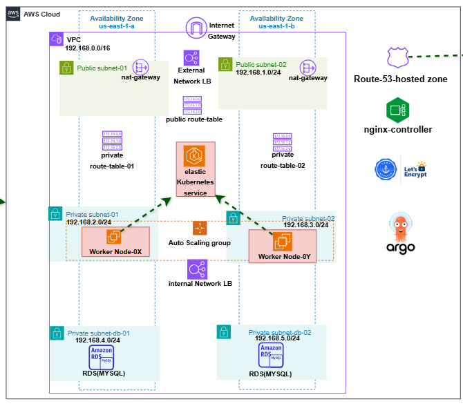

# Terraform EKS & Database Deployment

This repository contains the infrastructure-as-code (IaC) setup using **Terraform** to deploy a complete AWS environment, including VPC, EKS (Kubernetes), RDS database, and DNS. The deployment is automated using **GitHub Actions**.

---


## Infrastructure Project Structure

```bash
terraform-eks-db/
├── .github/workflows/          # GitHub Actions CI/CD workflows
├── .qodo/                      # Local automation/scripts (optional or internal tooling)
├── docker-git-runner-setup/   # Docker setup for custom GitHub runner (if used)
├── module-database/           # Terraform module to deploy RDS databases
├── module-dns/                # Terraform module for Route53 or other DNS setup
├── module-eks/                # Terraform module to deploy an EKS cluster
├── module-vpc/                # Terraform module to provision VPC and networking
├── .terraform.lock.hcl        # Provider and dependency lock file
├── .tflint.hcl                # Linting configuration for Terraform
├── 01-provider.tf             # AWS provider configuration
├── backend.tf                 # Remote state configuration (e.g., Terraform Cloud/S3)
├── deploy.yaml                # Sample GitHub Actions workflow (deprecated or backup)
├── main.tf                    # Main Terraform entry point that wires all modules
├── output.tf                  # Outputs of the infrastructure
├── readme.MD                  # You are here
├── terraform.tfvars           # Variable values
└── variable.tf                # Variable definitions.
```

## This is the architecture for the infrastruture deployment
# aws-three-tier-Deploy
# aws-three-tier-Deploy


├── .github/workflows/   # CI/CD pipeline definitions
├── terraform/           # Terraform configuration files
│   ├── modules/         # Reusable Terraform modules (VPC, EKS, etc.)
│   ├── environments/    # Environment-specific variables (dev, staging, prod)
│   ├── main.tf          # Root module configuration
│   ├── variables.tf     # Input variable definitions
│   ├── outputs.tf       # Output variable definitions
│   ├── backend.tf       # S3 backend and DynamoDB locking configuration
│   └── provider.tf      # AWS provider configuration
├── kubernetes/          # Kubernetes manifests and Helm charts
│   ├── app-deployment.yaml
│   ├── app-service.yaml
│   └── argocd-app.yaml  # ArgoCD Application definition
└── README.md            # Project documentation (this file)


Review the Execution Plan:
Review the proposed infrastructure changes before applying them.

Bash
    terraform plan -var-file="environments/dev.tfvars" # Replace with appropriate environment file
    ```

4.  **Apply the Infrastructure:**
    Provision the infrastructure on AWS.
    
```bash
    terraform apply -var-file="environments/dev.tfvars" --auto-approve
    ```

5.  **Configure `kubectl`:**
    Update your local kubeconfig to interact with the newly created EKS cluster.
    
```bash
    aws eks update-kubeconfig --region <aws-region> --name <cluster-name>
    ```

6.  **Deploy ArgoCD and Applications:**
    Apply the Kubernetes manifests to deploy ArgoCD and your application via GitOps.
    ```bash
    kubectl apply -f kubernetes/argocd-app.yaml
    ```

### 7. Known Issues & Troubleshooting

During the development and deployment phases, several challenges were encountered and resolved. These are documented below for future reference:

*   **Terraform State Drift & Kubernetes Unreachable Errors:**
    *   **Symptom:** Pipeline failures and `kubernetes cluster unreachable` errors during Terraform operations.
    *   **Cause:** Manual resource deletion via the AWS Management Console caused the actual infrastructure state to diverge from Terraform's tracked state file.
    *   **Resolution:** Implemented state cleanup techniques, specifically removing specific Helm releases from Terraform's state memory (`terraform state rm <resource_address>`) to realign the state file with the actual infrastructure.

*   **S3 Backend IAM Permission Issues:**
    *   **Symptom:** Initial failure to initialize Terraform or store state in the S3 backend.
    *   **Cause:** Insufficient or incorrectly configured IAM permissions for the principal executing Terraform.
    *   **Resolution:** Refined the IAM policy attached to the deployment user/role to explicitly grant `s3:PutObject`, `s3:GetObject`, and `s3:ListBucket` permissions on the designated state bucket, alongside required DynamoDB permissions for state locking.

*   **EKS Node Public IP Mapping:**
    *   **Symptom:** Inability to route traffic directly to EKS nodes or Pods in specific configurations.
    *   **Cause:** Subnet configuration lacked automatic public IP assignment, or routing tables were incorrectly pointing to the Internet Gateway.
    *   **Resolution:** Re-evaluated the networking architecture, ensuring worker nodes reside in private subnets with outbound internet access via NAT Gateways, while exposing services via internet-facing ALBs in public subnets.

*   **AWS Resource Quotas (Elastic IPs):**
    *   **Symptom:** Deployment failure during NAT Gateway creation due to exceeding the maximum allowed Elastic IPs per region.
    *   **Cause:** The default AWS account limit for Elastic IPs was reached.
    *   **Resolution:** Requested a quota increase via the AWS Service Quotas console or optimized the architecture to use fewer NAT Gateways (e.g., deploying one NAT Gateway per VPC instead of one per AZ for non-production environments).

*   **Route 53 SSL Certificate Propagation:**
    *   **Symptom:** Delays in accessing the application via HTTPS after initial deployment.
    *   **Cause:** ACM (AWS Certificate Manager) certificate validation and DNS propagation delays.
    *   **Resolution:** Ensured the correct DNS validation records were created in Route 53 and implemented pipeline delays or manual checks to wait for certificate issuance before finalizing ALB configurations.

*   **ArgoCD Authentication & Repository Connection:**
    *   **Symptom:** ArgoCD failed to sync with the Git repository due to authentication errors or UI glitches.
    *   **Cause:** Incorrectly formatted repository URLs or embedded credentials.
    *   **Resolution:** Adjusted the ArgoCD configuration to use a clean repository URL and managed credentials securely via Kubernetes Secrets or ArgoCD's native credential management, resolving the UI glitches.

### 8. Teardown Instructions

To avoid incurring unnecessary AWS charges, ensure you destroy the infrastructure when it is no longer needed.

```bash
cd terraform
terraform destroy -var-file="environments/dev.tfvars" --auto-approve
